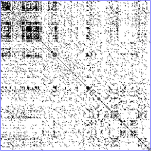

# MOS5.5-DataViz-TP-1

<h1 style:"fontsize:20pt;"> Dot Plots </h1>

<h2>Principe</h2>

Aussi appelés <i>Dot Charts</i>, les Dot Plots sont des graphiques qui consistent en des points représentant des valeurs discrètes d'un problème. 
Ces représentations sont donc adaptées aux informations dont les valeurs possibles sont prédéfinies ou facilement distingables les unes des autres. 
On retrouve ces graphiques dans deux grands domaines :  Les Statistiques et la BioInformatique.

<h2> Exemples Statistiques </h2>
<h3> Le Dot Plot du gouvernement Américain [1]</h3>

<i>Dot Plot des perspectives de croissance par le gouvernement Américain</i>

 

 Ce DotPlot est compréhensible grâce au codage du nombre de votant par la taille des points. Ces points apportent ainsi un bon rendu visuel des opinions exprimées. De plus la différentiation avec les points non coloriés permet de se rendre compte d'un changement dans les données et donc peuvent interpeller, faire apparaître une information omise.

<h2> Exemples BioInformatique [2]</h2>

Les DotPlots utilisés dans le domaine de la BioInformatique renseignent dans la plupart des cas sur une similarité entre deux variables. Leur particularité est que les axes sont déterminés par des vecteurs connus.

 
<h3>Ressemblances entre séquences zinguées [3]</h3>

<i>A DNA dotplot of a human zinc finger transcription factor</i>

 
Ce diagramme a pour point positif de facilement montrer des tendances de similarités, c'est à dire des régions qui se ressemblent beaucoup, mais il n'est pas facile de distinguer des différences locales si les vecteurs sont grands.

<h3>Similarité d'un signal [4]</h3>

<i>El Nino oscillations : similarities over time</i>

 
Ici on observe par le biais d'un dotplot la récurrence d'un phénomène métérologique - un courant marrin déterminant pour la météo à l'échelle mondiale- au fil du temps.
Ce diagramme est intéressant car il met en valeur les années pour lesquelles les phénomènes observés se rapprochent de phénomènes déjà observés. En d'autres termes, on peut déduire l'impact de El Nino une certaine année en récupérant l'historique de ses effets les années similaires à celle-ci ; et c'est ce diagramme qui nous indique quelles années regarder.

Sources :  
https://www.bloomberg.com/graphics/fomc-dot-plot/ : Famous Federal Governement's DotPlot [1] 
https://en.wikipedia.org/wiki/Dot_plot_(statistics)  
https://en.wikipedia.org/wiki/Dot_plot_(bioinformatics) [2] 
http://acces.ens-lyon.fr/acces/thematiques/evolution/logiciels/anagene/programmes-de-1ere-s-2011/expression-de-linformation-genetique/dotplot-1  
<a href='http://www.code10.info/index.php%3Foption%3Dcom_content%26view%3Darticle%26id%3D64:inroduction-to-dot-plots%26catid%3D52:cat_coding_algorithms_dot-plots%26Itemid%3D76'>code10.info</a>[3] 
<a href='https://en.wikipedia.org/wiki/Recurrence_plot'>https://en.wikipedia.org/wiki/Recurrence_plot</a>[4] 
