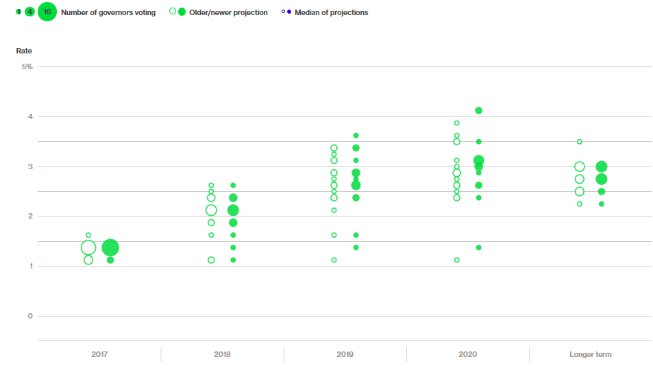
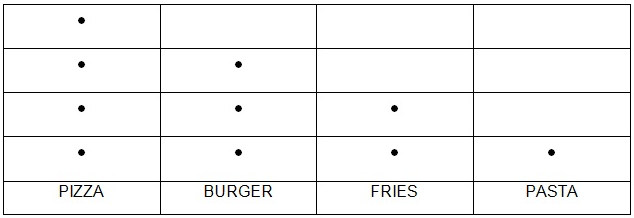
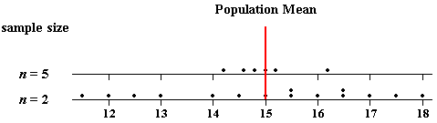
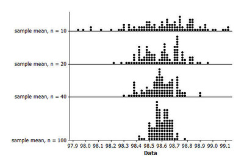
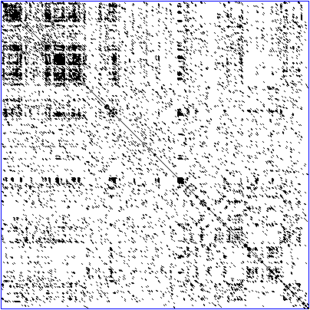
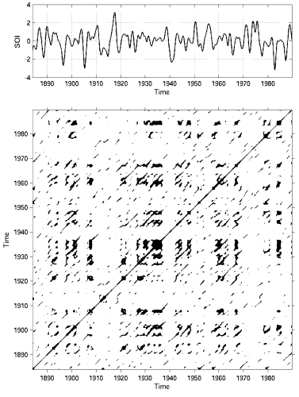

# MOS5.5-DataViz-TP-1

# Dot Plots

## I - Principe

Aussi appelés "Dot Charts", les Dot Plots sont des graphiques qui consistent en des points représentant des valeurs discrètes d'un problème.Ces représentations sont donc adaptées aux informations dont les valeurs possibles sont prédéfinies ou facilement distingables les unes des autres. On retrouve ces graphiques dans deux grands domaines :  Les Statistiques et la BioInformatique.
Dans le domaine des statistiques, ces DotPlots sont une bonne alternative aux histogrammes.

## II - Exemples Statistiques

### 1) Le Dot Plot du gouvernement Américain [1]

<i>Dot Plot des perspectives de croissance par le gouvernement Américain</i>

Ce DotPlot est compréhensible grâce au codage du nombre de votant par la taille des points. Ces points apportent ainsi un bon rendu visuel des opinions exprimées. De plus la différentiation avec les points non coloriés permet de se rendre compte d'un changement dans les données et donc peuvent interpeller, faire apparaître une information omise.

### 2) Population par catégorie

<i>Dot Plot : Type of food for snacks</i>

Les DotPlots Statistiques peuvent également être utilisés pour classer des individus ou groupes d'individus selon des criètres là encore discrets. Ce graphique en particulier très simple d'interprétation et très intuitif. Bien qu'aucune information ne soit donnée sur la signification de chaque point ; il est facile de comprendre le sens du graphique à savoir qu'au plus il y a de point dans chaque colonne, au plus chaque trait de caractère est représenté.

### 3) Visualisation d'une répartition

<i>Penn-State University : Sampling distribution of the mean</i>

La visualisation d'un DotPlot apporte également une information de répartition très important. Ici il apparraît clairement, grâce à la simplicité de ces graphiques, que les deux échantillions donnés ont des moyennes proches mais sont répartis de façons différentes. On peut encore le constater sur l'image ci-dessous : 

<i>Illustrative Mathematics : margin of error for estimating a population mean</i>

## III - Exemples BioInformatique [2]

Les DotPlots utilisés dans le domaine de la BioInformatique renseignent dans la plupart des cas sur une similarité entre deux variables. Leur particularité est que les axes sont déterminés par des vecteurs connus.

### 1) Ressemblances entre séquences zinguées [3]

<i>A DNA dotplot of a human zinc finger transcription factor</i>

Ce diagramme a pour point positif de facilement montrer des tendances de similarités, c'est à dire des régions qui se ressemblent beaucoup, mais il n'est pas facile de distinguer des différences locales si les vecteurs sont grands.

### 2) Similarité d'un signal [4]

<i>El Nino oscillations : similarities over time</i>

Ici on observe par le biais d'un dotplot la récurrence d'un phénomène métérologique - un courant marrin déterminant pour la météo à l'échelle mondiale- au fil du temps.Ce diagramme est intéressant car il met en valeur les années pour lesquelles les phénomènes observés se rapprochent de phénomènes déjà observés. En d'autres termes, on peut déduire l'impact de El Nino une certaine année en récupérant l'historique de ses effets les années similaires à celle-ci ; et c'est ce diagramme qui nous indique quelles années regarder.

### 3) Interprétation de pattern [5]

<i>Distance between two sequences</i>

On peut également utiliser des graphiques de ce type pour déterminer une distance élastique entre deux séquences de nombre, de vecteurs, de lettres,... Il suffit pour cela de représenter une distance classique à chaque intersection et alors des zones telles que repérées 1, 2.b et 2.c apparaîssent. Ces zones sont caractéristiques d'une égalité (1) entre les séquences, d'une insertion (2.b) de caractères ou encore d'une destruction (2.c) de caractères.Ce type de matrice est utilisé par exemple en reconnaissance de parole (comme vu lors du MOD 5.3 : Traitement et Analyse de données visuelles et sonores).
N.B : Sur cette image il ne s'agit pas de distance élastique, ici c'est surtout les zones d'intérêt mises en exergues que l'on étudie.

## IV - Tracer des DotPlots

Il existe de nombreux outils pour obtenir des DotPlots, ils offrent tous des niveaux différents de personnalisation. Pour les DotPlots Statistiques, on peut utiliser des outils très généraux tels que Excel tout comme on peut utiliser des outils plus complets et compliqués comme Tableau.

## V - Sources

* <a href='https://www.bloomberg.com/graphics/fomc-dot-plot/'>Famous Federal Governement's DotPlot</a>[1]
* <a ref='http://www.statisticshowto.com/what-is-a-dot-plot/'>what is a dot plot ?</a>[x]
* <a href='http://sites.stat.psu.edu/~ajw13/stat500_su_res/notes/lesson05/lesson05_03.html'>Penn State University</a>[x]
* <a href='https://www.illustrativemathematics.org/content-standards/tasks/1956'>illustrativemathematics.org</a>[x]
* <a href='https://en.wikipedia.org/wiki/Dot_plot_(statistics)'>DotPlot Statistics</a>
* <a href='https://en.wikipedia.org/wiki/Dot_plot_(bioinformatics)'>DotPlot BioInformatics</a>[2]
* <a href='http://acces.ens-lyon.fr/acces/thematiques/evolution/logiciels/anagene/programmes-de-1ere-s-2011/expression-de-linformation-genetique/dotplot-1'>Information génétique</a>
* <a href='http://www.code10.info/index.php%3Foption%3Dcom_content%26view%3Darticle%26id%3D64:inroduction-to-dot-plots%26catid%3D52:cat_coding_algorithms_dot-plots%26Itemid%3D76'>code10.info</a>[3]
* <a href='https://en.wikipedia.org/wiki/Recurrence_plot'>Reccurence_Plot</a>[4]
* <a href='https://ugene.net/wiki/pages/viewpage.action?pageId=4227426'>ugene.net</a> [5]
